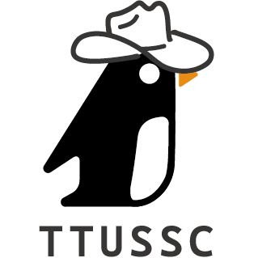

<div align="center">
  
  <h1>TTUSSC 科學開源服務社</h1>
  <p><strong>大同大學科學開源服務社官方網站</strong></p>

  <p>
    <a href="https://discord.com/invite/29PsKfe45h">
      
    </a>
    
    
    
  </p>
</div>

---

## 關於我們

TTUSSC（Tatung University Open Source and Service Club）致力於推廣開源文化、技術學習與志工服務。透過社課與講座學習開源工具，專案實作累積經驗，並參與資訊營隊與研討會志工。

## 技術棧

| 類別       | 工具                                    |
| ---------- | --------------------------------------- |
| 框架       | Vue 3 + Vue Router + Pinia              |
| 建置       | Vite 6                                  |
| 樣式       | Tailwind CSS 4                          |
| 圖示       | Font Awesome 7                          |
| 程式碼品質 | ESLint + Prettier + Husky + lint-staged |

## 快速開始

### 前置需求

- [Node.js](https://nodejs.org/) >= 18
- [Yarn](https://yarnpkg.com/) 1.x

### 安裝與啟動

```bash
# 安裝依賴
yarn

# 啟動開發伺服器
yarn dev
```

### 其他指令

```bash
# 建置生產版本
yarn build

# 預覽建置結果
yarn preview

# 程式碼檢查與修正
yarn lint

# 格式化程式碼
yarn format
```

## 專案結構

```
src/
├── assets/          # 全域樣式
├── components/      # 共用元件（NavBar、Footer 等）
├── data/            # 靜態資料（社員、社課）
├── router/          # 路由設定
├── utils/           # 工具函式
└── views/           # 頁面元件
```

## 文件

- [Font Awesome 使用指南](doc/fontawesome.md)

## 貢獻

歡迎所有社員與有興趣的朋友一起貢獻！

1. Fork 這個專案
2. 建立你的分支 (`git checkout -b feature/amazing-feature`)
3. 提交變更 (`git commit -m 'feat: add amazing feature'`)
4. 推送到分支 (`git push origin feature/amazing-feature`)
5. 開一個 Pull Request

## 授權

本專案採用 [MIT License](LICENSE) 授權。

---

<div align="center">
  <sub>Made by TTUSSC</sub>
</div>
