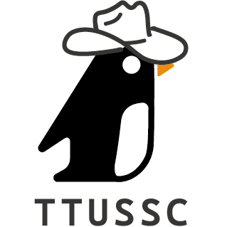

<div align="center">
  
  <h1>TTUSSC 科學開源服務社</h1>
  <p><strong>大同大學科學開源服務社官方網站</strong></p>

  <p>
    <a href="https://discord.com/invite/29PsKfe45h">
      
    </a>
    
    
    
  </p>
</div>

---

## 關於我們

TTUSSC（Tatung University Open Source and Service Club）致力於推廣開源文化、技術學習與志工服務。透過社課與講座學習開源工具，專案實作累積經驗，並參與資訊營隊與研討會志工。

## 技術棧

| 類別       | 工具                      |
| ---------- | ------------------------- |
| 框架       | Astro 7（靜態輸出）       |
| 樣式       | Tailwind CSS 4            |
| 內容管理   | Astro Content Collections |
| 多語言     | astro:i18n（zh-tw / en）  |
| 套件管理   | pnpm                      |
| 程式碼品質 | Prettier + pre-commit     |

## 快速開始

### 前置需求

- [Node.js](https://nodejs.org/) >= 22.12.0
- [pnpm](https://pnpm.io/)
- [uv](https://docs.astral.sh/uv/)（跑 `scripts/` 底下的 Python 腳本與部分 pre-commit hook 用）
- [pre-commit](https://pre-commit.com/)

### 安裝與啟動

```bash
# 安裝依賴
pnpm install

# 安裝 git hooks（格式化、圖片最佳化、commit message 檢查等）
pre-commit install --hook-type pre-commit --hook-type commit-msg

# 啟動開發伺服器
pnpm dev
```

### 其他指令

```bash
# 建置生產版本
pnpm build

# 預覽建置結果
pnpm preview

# 型別與內容檢查
pnpm astro check

# 格式化程式碼
pnpm exec prettier --write .
```

## 專案結構

```
src/
├── assets/           # 圖片等靜態資源（經 Astro image 最佳化）
├── components/       # 共用元件
├── content/          # 內容集合（lectures、members、events）
├── content.config.ts # 內容集合的 schema 定義
├── i18n/             # 語言字典與工具函式
├── layouts/          # 頁面版型
├── lib/              # 工具函式
├── pages/            # 路由（含 /en/ 對應的英文版本）
└── styles/           # 全域樣式
```

## 貢獻

歡迎所有社員與有興趣的朋友一起貢獻！

1. Fork 這個專案
2. 建立你的分支 (`git checkout -b feature/amazing-feature`)
3. 提交變更 (`git commit -m 'feat: add amazing feature'`)
4. 推送到分支 (`git push origin feature/amazing-feature`)
5. 開一個 Pull Request

## 授權

本專案採用 [MIT License](LICENSE) 授權。

---

<div align="center">
  <sub>Made by TTUSSC</sub>
</div>
